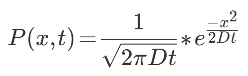
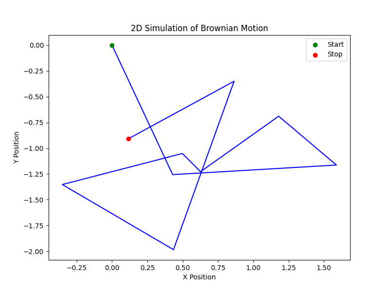
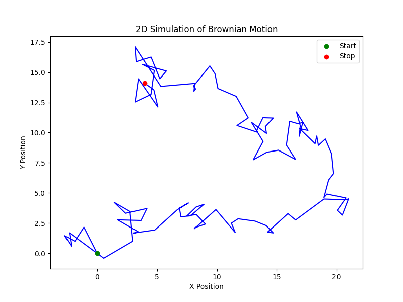
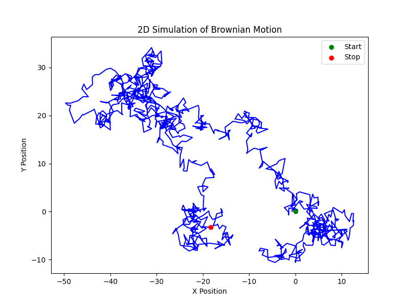
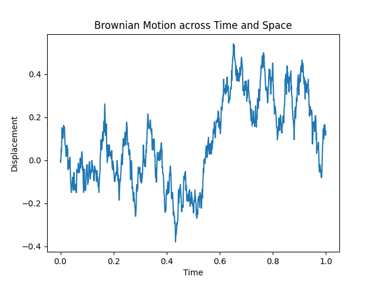
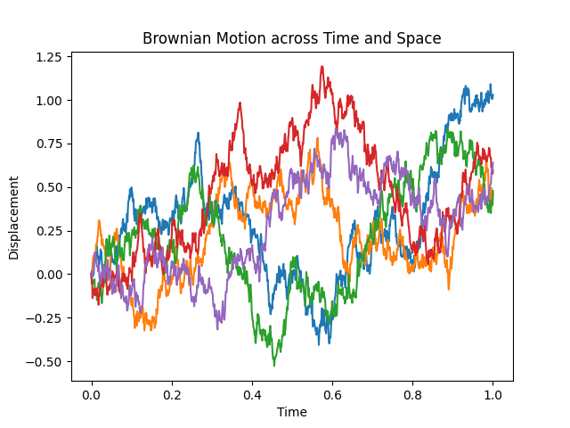
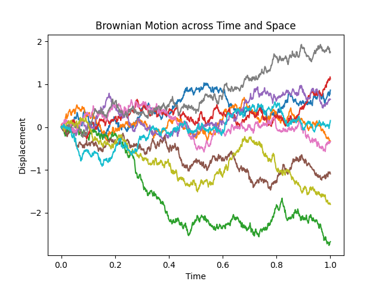
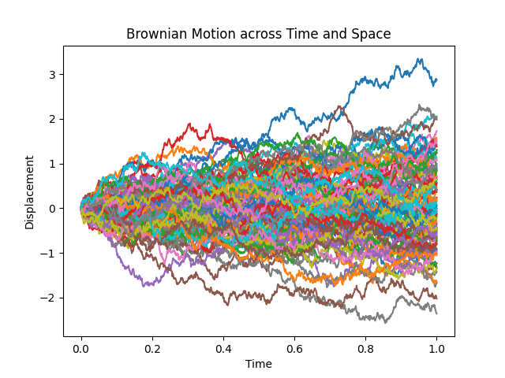

# Mathematical Modelling of Brownian Motion

## Instructions to run the program

1. Install Python on your system. You can download and follow the [instructions given here](https://www.python.org/downloads/).

2. Download this repository or clone it to your local machine.

3. To generate the simulation of the particle in 2D, execute the `simulate_2d_motion.py` with your preferred editor or by running the following command.

```bash
python simulate_2d_motion.py
```

4. To generate the brownian motion(s) across time and space, execute the `simulate_time_and_space_motion.py` with your preferred editor or by running the following command.

```bash
python simulate_time_and_space_motion.py
```

5. Before running any tests, kindly run the following command to install `pytest`.

```bash
pip install pytest
```

6. To test the util functions, run the following command.

```bash
pytest test_utils.py
```

7. To test the `simulate_2d_motion.py`, run the following command.

```bash
pytest test_simulate_2d_motion.py
```

8. To test the `simulate_time_and_space_motion.py`, run the following command.

```bash
pytest test_simulate_time_and_space_motion.py
```

----

## Brownian Motion
The phenomena of Brownian motion is the seemingly random movement of particles suspended in a fluid, caused by their continuous collisions with the molecules of the surrounding medium. This phenomenon is named after the botanist Robert Brown, who observed it in 1827 while studying pollen grains in water. From a physical and mathematical viewpoint, Brownian motion is not just a biological curiosity but a fundamental process that explains how particles move in various environments. It forms the basis for many real-world phenomena, from the diffusion of gases to the behavior of microscopic objects in fluids.

## The Mathematical Model of Brownian Motion

Mathematically, Brownian motion is modeled as a stochastic process, meaning it describes systems that evolve randomly over time. The formal model often used is a *Wiener process*, where the position of a particle at time (`t`), denoted (`B(t)`), follows these rules:

- The particle starts at `B(0) = 0`.
- Over any time interval, the displacement is normally distributed, meaning its future path is independent of past behavior.
- The variance of the displacement grows proportionally with time, `Var(B(t)) = t`, implying that the further into the future we look, the greater the spread of possible positions.

The probability distribution of a particle’s displacement after a certain time is Gaussian (bell-shaped). For one-dimensional Brownian motion, the probability of finding a particle at position (`x`) at time (`t`) is given by:



where (`D`) is the diffusion coefficient, which depends on factors like temperature and the fluid's viscosity.

## Visualizing Brownian Motion: How It’s Plotted

When we plot Brownian motion, we typically track the particle’s position over time. In *one dimension*, this is simply a plot of position `x(t)` against time. The trajectory looks jagged and erratic, reflecting the randomness of the motion.

In 2-D, we can plot the particle’s path in the `XY`-plane. This creates a winding, unpredictable curve where the particle meanders across the plane. Over time, this path becomes more spread out, following the Gaussian distribution of displacement.

A typical *2D plot of Brownian motion* starts with the particle at the origin `(0, 0)`. Each point on the graph shows where the particle is located at a specific time. As time progresses, the particle’s movement forms a random trail, and its probability of being found at any position becomes more widely distributed, centered around the origin.

## Real-Life Applications of Brownian Motion

*Brownian motion* is not just a theoretical construct; it has profound implications in both the microscopic and macroscopic world. Here’s how it influences different areas of physics and beyond:

1. ***Diffusion***: One of the most direct physical manifestations of Brownian motion is diffusion, where particles spread from areas of high concentration to low concentration. Whether it’s molecules of perfume spreading in a room or oxygen diffusing into tissues, the underlying process is modeled by Brownian motion.

2. ***Thermodynamics and Statistical Physics***: Brownian motion is closely tied to the idea of thermal fluctuations. In statistical mechanics, it illustrates how particles behave at non-zero temperatures. It also supports the **fluctuation-dissipation theorem**, which links random fluctuations (like Brownian motion) to dissipation processes (like drag forces).

3. ***Nanotechnology and Microphysics***: On a small scale, Brownian motion is essential in understanding how tiny particles behave in fluids. For instance, it plays a role in **colloidal dynamics*, where particles like nanoparticles or biological cells move randomly in suspension. This random movement is key in fields like biophysics, where it helps explain cellular transport and molecule diffusion within cells.

4. ***Polymers and Biological Systems***: Long chain molecules, like proteins or DNA, undergo Brownian-like random motion. The study of how polymers "wiggle" and fold relies on random walk models derived from Brownian motion principles. This is critical for understanding how biological molecules behave in solution.

5. ***Stock Market Modeling***: Although not a physical application, the same mathematical framework used to describe Brownian motion has been adapted in finance. The **Black-Scholes model** for option pricing uses a form of Brownian motion to model stock price fluctuations, reflecting the randomness of market behavior.


In essence, Brownian motion helps us understand the random, chaotic movements that dominate the microscopic world. Whether it’s molecules spreading out in a fluid, nanoparticles jiggling in suspension, or stock prices fluctuating, the same core principles of randomness and diffusion apply. 

In physics, this randomness is not just noise—it's a fundamental part of how particles interact with their surroundings. Each tiny, random step that a particle takes, whether in one or two dimensions, leads to large-scale phenomena like diffusion and thermal fluctuation. Brownian motion serves as a bridge between the microscopic, seemingly chaotic world and the macroscopic laws that govern how substances mix, how energy flows, and even how markets evolve.

---

## Project Structure

1. The project has code to simulate 2D Brownian Motion of a particle and to simulate multiple Brownian Motions across Time and Space.
2. The core logic of simulating 2D Browninan Motion is coded in the [simulate_2d_motion.py](https://github.com/KThani99/mathematical-modelling-of-brownian-motion/blob/main/simulate_2d_motion.py) file.
3. The core logic of simulating Brownian Motions across Time and Space is coded in the [simulate_time_and_space_motion.py](https://github.com/KThani99/mathematical-modelling-of-brownian-motion/blob/main/simulate_time_and_space_motion.py) file.
4. Both of the functions, saves their output to the `output-images` folder.
5. The test cases for simulating 2D Motion is present in the [test_simulate_2d_motion.py](https://github.com/KThani99/mathematical-modelling-of-brownian-motion/blob/main/test_simulate_2d_motion.py) file.
6. The test cases for simulating Brownian Motions across Space and Time is present in the [test_simulate_time_and_space_motion.py](https://github.com/KThani99/mathematical-modelling-of-brownian-motion/blob/main/test_simulate_time_and_space_motion.py) file.
7. Additionally, test cases for util functions is also written in the [test_utils.py](https://github.com/KThani99/mathematical-modelling-of-brownian-motion/blob/main/test_utils.py) file.

---

## Sample Results

### 2D Brownian Motion of a Single Particle

#### 10 Time Steps



#### 100 Time Steps



#### 1000 Time Steps



### Bownian Motion across Time and Space (1000 sample points)

#### 1 Particle



#### 5 Particles



#### 10 Particles



#### 100 Particles



---